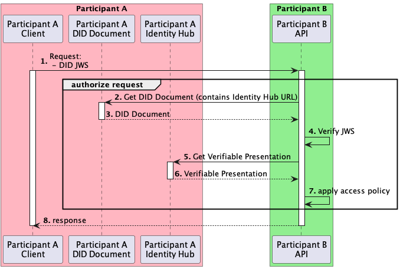
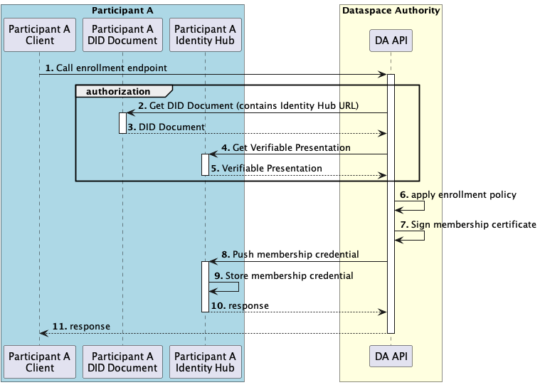

# Identity Hub ADR

An identity hub is a credential storage and message relay system run by a dataspace participant. In particular, the identity hub will be used to securely deliver [verifiable credentials](https://www.w3.org/TR/vc-data-model/#what-is-a-verifiable-credential) from a dataspace issuer to a dataspace participant. The hub will also be used to provide verifiable presentations on behalf of a participant.

The [Identity Hub specification](https://github.com/Metaform/mvd/blob/main/identity-hub/identity-hub-tech-spec.md) provides an extensive description of different aspects that need to be supported by the Identity Hub in its final version. This document focuses on what the first version of the Identity Hub will have to support to enable the MVD (Minimum Viable Dataspace).

## Operations

The Identity Hub will adhere to the [Decentralized Web Node specification](https://identity.foundation/decentralized-web-node/spec/) implementing the following subset of operations.

* [Collections Query](https://identity.foundation/decentralized-web-node/spec/#query) to query Verifiable Credentials
* [Collections Write](https://identity.foundation/decentralized-web-node/spec/#write) to push Verifiable Credentials
* [Feature Detection](https://identity.foundation/decentralized-web-node/spec/#feature-detection) listing all the aforementioned operations as supported.

Each participant in the dataspace will have a single identity and a single Identity Hub instance available (no namespacing required). The Identity Hub endpoints will not be secured with any kind of auth.

## Example Flows

### Participant Authorization

During participant to participant communication the Identity Hub of the provider participant queries Verifiable Credentials of the consumer participant. According to the policies in place and the available Verifiable Credentials access to resources is granted or denied.

### Participant Onboarding

When participants are successfully onboarded to a dataspace, the dataspace authority pushes a "dataspace membership" Verifiable Credential into the Identity Hub. This VC is then handed over to other participants during the authorization flow, which can enforce dataspace membership as a requirement for communication. 

## Deployment

The Identity Hub will be developed as an EDC extension and will be deployed as a [collocated test deployment](https://github.com/Metaform/mvd/blob/main/identity-hub/identity-hub-tech-spec.md#1-collocated-test-deployment) within the participant connector.

## References

- [Decentralized Web Node](https://identity.foundation/decentralized-web-node/spec/) draft specification
- [Verifiable Credentials](https://www.w3.org/TR/vc-data-model/) W3C recommendation
- [Web DID](https://w3c-ccg.github.io/did-method-web) draft specification
- Stefan van der Wiele - [Decentralized Identifiers and the Eclipse Dataspace Connector](https://www.youtube.com/watch?v=ic-XEGzdODM) (YouTube video)

